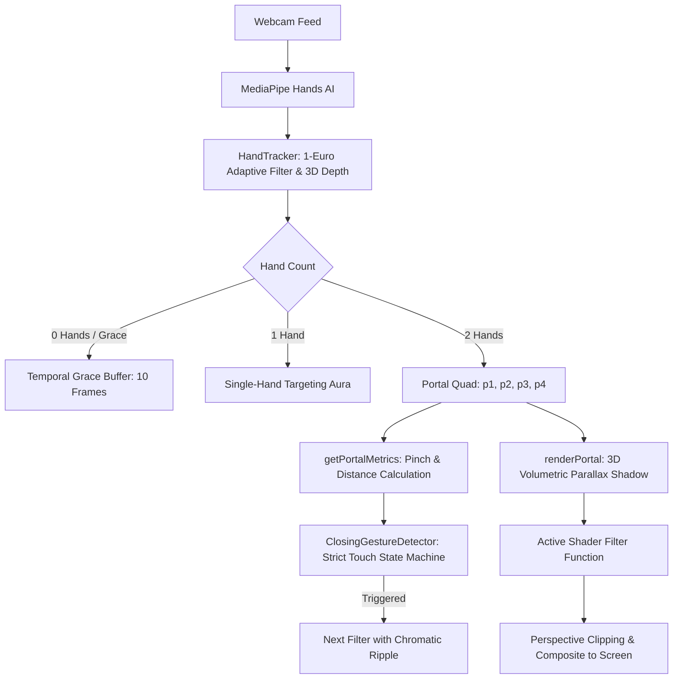

# 🤖 AGENTS.md — Hand Gesture AR Filter System Architecture & Guidelines

> **Target Audience**: AI Coding Assistants, LLM Agents, and Core Contributors.  
> **Repository Context**: High-precision WebGL & Canvas 2D Augmented Reality Hand Tracking and Shader Processing System.

---

## ⚠️ 1. Absolute Workspace Rules & Constraints

1. **Strict File Isolation**:
   - **DO NOT TOUCH** any files inside the `Main/` directory under any circumstances.
   - All client-side application logic, shaders, styles, assets, and documentation **must remain strictly within the `web/` folder**.
2. **Zero Build Step / Pure Vanilla ES6**:
   - Do not introduce heavy bundling frameworks (Webpack, Vite, Next.js, Rollup) unless explicitly requested.
   - Use standard ES6 native modules (`import`/`export`), HTML5, Vanilla CSS3 custom properties, and native Canvas 2D / WebGL contexts.
3. **Zero-Allocation Render Loops**:
   - In render and filter execution functions, never allocate dynamic objects (`new Object()`, `new Array()`, `[x, y]`) inside per-pixel loops.
   - Reuse pre-allocated typed arrays (`Float32Array`, `Uint8Array`, `Uint8ClampedArray`) and precomputed lookup tables (e.g., `JET_LUT`, `BAYER_8X8`, `scratchNormalField`).

---

## 🏛️ 2. Architectural Blueprint



---

## 📦 3. Module Specifications & Contracts

### 3.1 `tracking.js` (`HandTracker`)
- **Key Responsibilities**:
  - Initializes `@mediapipe/hands` from CDN with `minDetectionConfidence: 0.15` and `minTrackingConfidence: 0.15`.
  - Computes kinematic phalanx bone projections for Index (`getStabilizedIndexTip`) and Thumb (`getStabilizedThumbTip`).
  - Estimates 3D hand depth disparity ($Z_L, Z_R$) using palm physical scale in image coordinates.
  - Implements **1-Euro Adaptive Filter** to freeze micro-jitter when motionless while eliminating lag during fast movement.
  - Maintains **10-Frame Temporal Grace Persistence** (`lastValidPortalData`) so fast hand movements and wide separations never drop the portal quad.

### 3.2 `geometry.js` (`renderPortal`, `ClosingGestureDetector`)
- **Key Responsibilities**:
  - `ClosingGestureDetector`: Evaluates strict touch triggers when **both** index fingers and thumbs touch simultaneously ($\text{topW} \le \text{closeThreshold} \land \text{bottomW} \le \text{closeThreshold}$) with a 350ms debounce.
  - `buildPortalPath`: Constructs straight quad or elastic cubic bezier curves based on hand tension.
  - `renderPortal`:
    1. Computes 3D plane rotation (Yaw, Pitch, Roll) from hand depth differential.
    2. Projects a **volumetric parallax drop shadow** in the direction of the 3D surface normal.
    3. Extracts ROI image data, executes the active visual shader, and clips to the elastic quad.
    4. Renders asymmetric border thickness ($1.4\times$ on closer hand) and chromatic neon bloom.

### 3.3 `filters.js` (`FILTERS`)
- **Key Contract**:
  - Every filter is a pure function: `filterFn(imageData: ImageData, width: number, height: number): ImageData`.
  - Must operate in-place or transfer through `imageData.data` clamped array.
- **Active 10-Shader Lineup**:
  - `filtro_crimson_noir` (`01`): Cyberpunk blood red & porcelain white posterization.
  - `filtro_liquid_chrome` (`02`): Liquid mercury surface reflections on body with greyish-black background & glowing quantum particles.
  - `filtro_cristal` (`03`): Procedural scratch normal refraction & ice fracture veins.
  - `filtro_void_ascii` (`04`): Matrix silhouette void with chromatic aberration glyph halos.
  - `filtro_manga_halftone` (`05`): Burgundy screentone on cream paper.
  - `filtro_xray` (`06`): Radiography density inversion with scanlines.
  - `filtro_ascii` (`07`): Full matrix $6\times 6$ ASCII glyph terminal.
  - `filtro_dither` (`08`): $8\times 8$ Bayer matrix ordered dithering.
  - `filtro_5` (`09`): Precomputed 256-entry JET colormap thermal infrared.
  - `filtro_rosa` (`10`): Magenta pop-art circular halftone dots.

### 3.4 `app.js` (`ARFiltersApp`)
- **Key Responsibilities**:
  - Pre-initializes MediaPipe on page load for instantaneous startup.
  - Controls camera stream lifecycle via `navigator.mediaDevices.getUserMedia`.
  - Runs continuous `requestAnimationFrame` render loop and asynchronous tracking pipeline.
  - Synchronizes UI components (dock, dropdown menu, status pills, settings modal, snapshot exporter).

---

## 🧮 4. 3D Coordinate Mapping & Viewport Transformation

1. **Mirrored Viewport Alignment**:
   - The canvas element uses CSS `transform: scaleX(-1)`.
   - In raw camera coordinates, the user's physical left hand appears on the right side ($x > 0.5$).
   - `tracking.js` maps the hand with larger raw $x$ to screen-left ($p_1, p_2$) and smaller raw $x$ to screen-right ($p_3, p_4$), ensuring natural intuitive quad alignment.
2. **Relative 3D Hand Depth Disparity**:
   $$Z = \frac{1}{\max(0.04, \|\mathbf{p}_{\text{wrist}} - \mathbf{p}_{\text{middle\_mcp}}\|)} \cdot 0.75 + z_{\text{raw}} \cdot 2.5$$
   $$\text{yawDeg} = \text{clamp}\left(\frac{Z_{\text{right}} - Z_{\text{left}}}{\text{avg}(Z)} \cdot 48.0, -60, 60\right)$$

---

## 🔧 5. Development & Testing Workflow

### Running Locally:
```bash
python -m http.server 8000 --directory web
```
Visit `http://localhost:8000` in Google Chrome or Microsoft Edge.

### Diagnostic Shortcuts in App:
- Press `S` to enable landmark joint skeleton overlays.
- Press `[` / `]` or `1`–`9`, `0` to cycle through all 10 visual shaders.
- Press `O` to inspect and adjust touch sensitivity ratios (`closeRatio`, `openRatio`).
